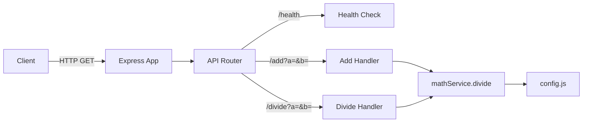
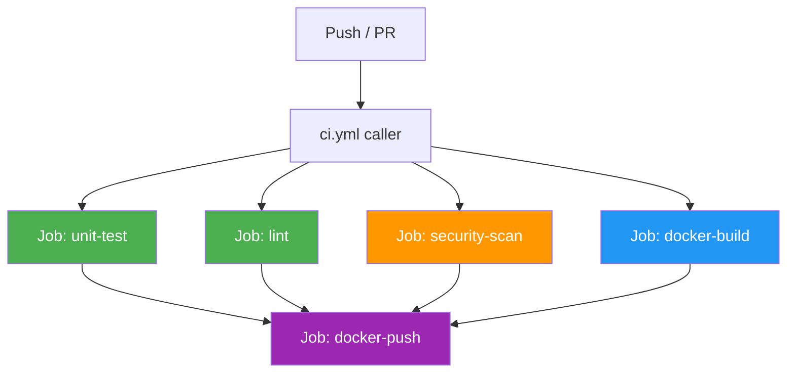

# CI Training Lab — Thực Hành CI/CD với GitHub Actions

> **Khoá học thực hành**: Xây dựng CI pipeline chuyên nghiệp từ đầu bằng GitHub Actions  
> **Trình độ**: Beginner → Intermediate  
> **Thời lượng**: 12 bài học  

---

## Giới thiệu

Repository này là môi trường học tập cho khoá đào tạo **Continuous Integration (CI) với GitHub Actions**.

Học viên sẽ thực hành:
- Xây dựng CI pipeline từng bước qua 12 bài học
- Phát hiện và sửa các lỗi pipeline trong môi trường thực tế
- Áp dụng best practices bảo mật (Trivy, Gitleaks)
- Tối ưu pipeline với caching, parallel jobs và reusable workflows

**Ứng dụng**: REST API đơn giản viết bằng Node.js/Express — mục tiêu là học CI, không phải backend development.

---

## Kiến trúc ứng dụng



---

## Endpoints API

| Method | Endpoint | Mô tả | Ví dụ |
|--------|----------|-------|-------|
| `GET` | `/health` | Kiểm tra trạng thái server | `{"status":"ok"}` |
| `GET` | `/add?a=1&b=2` | Cộng hai số | `3` |
| `GET` | `/divide?a=10&b=2` | Chia hai số | `5` |

---

## Cấu trúc thư mục

```
ci-training-lab/
├── .github/
│   └── workflows/
│       ├── ci.yml                  # CI pipeline (bài học cuối = caller)
│       └── reusable-build.yml      # Reusable workflow (bài 12)
├── src/
│   ├── app.js                      # Express app entry point
│   ├── config.js                   # Cấu hình từ environment variables
│   └── routes/
│       ├── api.js                  # Route handlers
│   └── services/
│       └── mathService.js          # Business logic: add(), divide()
├── tests/
│   └── mathService.test.js         # Jest unit tests
├── scripts/
│   ├── init-git-history.sh         # Script khởi tạo git history đào tạo
│   └── stages/                     # Delta files cho từng bài học
│       ├── v0-start/
│       ├── v1-unit-test-fail/
│       └── ...
├── docs/                           # Tài liệu kỹ thuật với Mermaid diagrams
├── .eslintrc.js                    # ESLint v8 configuration
├── .gitleaks.toml                  # Gitleaks custom rules
├── .dockerignore                   # Docker build exclusions
├── Dockerfile                      # Multi-stage production Dockerfile
├── jest.config.js                  # Jest configuration
├── package.json
├── README.md
└── TRAINER_GUIDE.md                # Hướng dẫn cho trainer
```

---

## Cài đặt và chạy local

### Yêu cầu

- Node.js 22 LTS
- npm 10+
- Docker (tuỳ chọn)

### Cài đặt

```bash
# Clone repository
git clone <repository-url>
cd ci-training-lab

# Cài đặt dependencies
npm install

# Chạy ứng dụng
npm start
```

### Kiểm tra API

```bash
# Health check
curl http://localhost:3000/health
# Response: {"status":"ok"}

# Cộng hai số
curl "http://localhost:3000/add?a=1&b=2"
# Response: 3

# Chia hai số
curl "http://localhost:3000/divide?a=10&b=2"
# Response: 5

# Chia cho 0 (xử lý lỗi)
curl "http://localhost:3000/divide?a=10&b=0"
# Response: {"error":"Division by zero is not allowed"}
```

---

## Chạy Unit Tests

```bash
# Chạy tất cả tests
npm test

# Xem coverage report
npm test -- --coverage

# Chạy test ở watch mode (phát triển)
npm test -- --watch
```

---

## Linting

```bash
# Kiểm tra lint errors
npm run lint

# Tự động sửa lint errors
npm run lint:fix
```

---

## Docker

```bash
# Build image (Dockerfile tốt - final state)
docker build -t ci-training-lab .

# Chạy container
docker run -p 3000:3000 ci-training-lab

# Kiểm tra
curl http://localhost:3000/health

# Xem image size
docker images ci-training-lab
```

---

## GitHub Actions Pipeline

Pipeline được xây dựng dần qua 12 bài học. Trạng thái cuối cùng:



---

## Bảng tham khảo Git Tags

| Tag | Bài học | Trạng thái | Thay đổi chính |
|-----|---------|-----------|----------------|
| `v0-start` | 0 | ✅ | Khởi tạo project |
| `v1-unit-test-fail` | 1 | 🔴 FAIL | Thêm CI + test sai |
| `v2-unit-test-fix` | 2 | ✅ | Sửa test |
| `v3-lint-fail` | 3 | 🔴 FAIL | Thêm ESLint + code có lỗi |
| `v4-lint-fix` | 4 | ✅ | Sửa lint errors |
| `v5-cache` | 5 | ✅ | Thêm npm cache |
| `v6-docker-build` | 6 | ✅ | Thêm Docker build |
| `v7-trivy-fail` | 7 | 🔴 FAIL | Thêm Trivy + deps dễ bị tấn công |
| `v8-trivy-fix` | 8 | ✅ | Sửa Dockerfile + upgrade deps |
| `v9-gitleaks-fail` | 9 | 🔴 FAIL | Thêm Gitleaks + hardcoded secret |
| `v10-gitleaks-fix` | 10 | ✅ | Xoá secret, dùng env var |
| `v11-ghcr` | 11 | ✅ | Push image lên GHCR |
| `v12-reusable-workflow` | 12 | ✅ | Parallel jobs + reusable workflow |

### Cách checkout từng bài học

```bash
# Xem tất cả tags
git tag -l

# Checkout một tag để xem code tại thời điểm đó
git checkout v1-unit-test-fail

# Quay lại main branch
git checkout main
```

---

## Mục tiêu đào tạo

Sau khoá học, học viên có thể:

- [ ] Hiểu CI là gì và tại sao cần CI
- [ ] Viết GitHub Actions workflow cơ bản
- [ ] Tích hợp unit tests vào CI pipeline
- [ ] Cấu hình ESLint và chạy trong CI
- [ ] Sử dụng caching để tăng tốc pipeline
- [ ] Build và test Docker image trong CI
- [ ] Phát hiện lỗ hổng bảo mật với Trivy
- [ ] Phát hiện secret bị lộ với Gitleaks
- [ ] Push Docker image lên GitHub Container Registry
- [ ] Thiết kế pipeline với parallel jobs
- [ ] Tạo và sử dụng reusable workflows

---

## Bài tập cho học viên

### Bài tập cơ bản

1. **Viết thêm unit tests**: Thêm tests cho các edge case chưa được kiểm tra (số âm chia cho số dương, số rất lớn)
2. **Thêm endpoint mới**: Thêm `/multiply?a=3&b=4` trả về `12` và viết unit tests
3. **Cấu hình ESLint nghiêm hơn**: Thêm rule `no-magic-numbers` vào `.eslintrc.js`

### Bài tập nâng cao

4. **Matrix testing**: Cấu hình CI chạy tests trên nhiều Node.js versions (18, 20, 22)
5. **Notification**: Thêm bước gửi notification Slack khi pipeline fail
6. **Semantic versioning**: Tự động bump version và tạo GitHub Release khi push lên main
7. **SBOM**: Thêm bước tạo Software Bill of Materials với Trivy

### Bài tập thực tế

8. **Branch protection**: Cấu hình GitHub repository để yêu cầu CI pass trước khi merge PR
9. **Dependency update**: Tìm và sửa thêm 2 vulnerable dependencies bằng `npm audit`
10. **Custom Gitleaks rule**: Viết custom rule phát hiện connection strings đến database

---

## Câu hỏi thường gặp

**Q: Tại sao pipeline fail ở v1?**  
A: Test có lỗi cố ý (`toBe(4)` thay vì `toBe(3)`). Đây là bài học về tầm quan trọng của unit tests trong CI.

**Q: Tại sao dùng lodash chỉ để kiểm tra kiểu dữ liệu?**  
A: Để tạo một dependency thực tế có thể có CVE. Trong dự án thực, bạn sẽ dùng lodash cho nhiều utility functions hơn.

**Q: GHCR push có hoạt động không cần cấu hình gì thêm?**  
A: Có. `GITHUB_TOKEN` được GitHub Actions cung cấp tự động. Chỉ cần đảm bảo package visibility là `public` hoặc cấp quyền `packages: write`.

**Q: Gitleaks có quét git history không?**  
A: Có, với `fetch-depth: 0`. Vì vậy dù đã xoá secret ở v10, secret vẫn còn trong git history tại v9. Đây là bài học quan trọng về tầm quan trọng của việc không commit secrets.

---

## Đóng góp

Đây là repository đào tạo. Mọi issue hoặc cải tiến vui lòng tạo Pull Request.

---

## License

MIT License — xem [LICENSE](LICENSE) để biết thêm.

